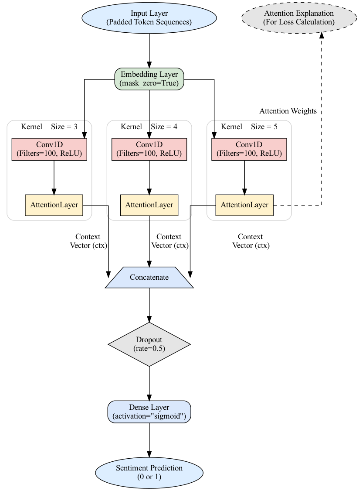
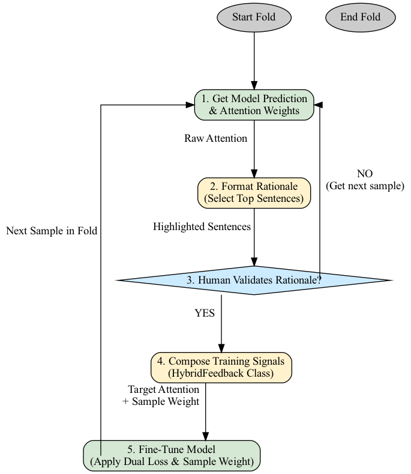

# hybrid_feedback_for_faithful_explanations

# Two Levers: A Hybrid Approach for Improving Faithfulness in Explainable AI

This repository contains the code and resources for my Bachelor's thesis at the University of Groningen, supervised by Dr. J.S. Dibangoye. The project investigates a novel hybrid feedback system designed to improve the faithfulness of explanations generated by an attention-based TextCNN for sentiment analysis.




## Key Features

-   **Attention-based TextCNN:** A dual-output Keras model for sentiment classification and explanation generation.
-   **Interactive Feedback Loop:** A command-line interface for real-time human validation of machine-generated rationales.
-   **Hybrid Signal Generation:** A system that blends human judgment with an automated AI "focus score" to create synergistic training signals.
-   **Comprehensive Evaluation:** Includes ablation studies to isolate the effects of each component on both accuracy and faithfulness.

## Methodology Overview

The core of the project is a hybrid feedback loop designed to "tutor" the AI model.



1.  **Model Proposes:** The TextCNN generates a prediction and highlights sentences as its rationale.
2.  **Human Validates:** A human teacher provides a simple "Yes/No" judgment on the rationale's quality.
3.  **System Learns:** This feedback is converted into two signals:
    -   **Explanation Guidance (`Attention as Loss`):** A `cosine_similarity_loss` teaches the attention mechanism to mimic human-approved patterns.
    -   **Performance Reward (`Sample Weighting`):** The main prediction loss is weighted to emphasize learning from examples with high-quality rationales.

## Key Results

Our experiments show that the two feedback signals act as distinct "levers." The Performance Reward is the primary driver of accuracy, while the human-guided Explanation Guidance is curcial for faithfulness performacne. The full hybrid model needs best in order for the best results.

| Model Configuration | Accuracy | Deletion Score (Faithfulness) |
| :--- | :--- | :--- |
| Baseline | 0.8050 | 0.1650 |
| Ablation A (Guidance Only) | 0.8150 | -0.1579 |
| Ablation B (Rewards Only) | **0.8550** | 0.0419 |
| **Full Hybrid (Human-Guided)** | **0.8550** | **0.2580** |

## Setup and Installation

This project was implemented in Python 3.11 using TensorFlow 2.16.

1.  **Clone the repository:**
    ```bash
    git clone [https://github.com/qThunder1/hybrid-feedback_for_faithful_explanations.git](https://github.com/qThunder1/hybrid_feedback_for_faithful_explanations.git)
    cd hybrid_feedback_for_faithful-explanations
    ```

2.  **Create a virtual environment (recommended):**
    ```bash
    python -m venv env
    source env/bin/activate  # On Windows, use `env\Scripts\activate`
    ```

3.  **Install dependencies:**
    ```bash
    pip install -r requirements.txt
    ```
    *(You will need to create a `requirements.txt` file by running `pip freeze > requirements.txt` in your working environment).*

4.  **Download the Dataset:**
    The movie review dataset used in this project is based on the structure from Zaidan (2007). Please download and place the `movies` directory inside the `data/` folder. The repository does not include the dataset itself.
    
## How to Run in Google Colab

If you are running this project in a Google Colab notebook, you can use the following steps to set up the data.
1.  **Prepare your data:** Place your movies directory into a .zip file (e.g., movies.zip).:**

2.  **Upload and Unzip:**
    In a new Colab notebook, run the following code cell, found in src/colab_preprocess.py file. It will prompt you to upload your movies.zip file and will automatically extract it into the correct directory structure.

## How to Run the Experiments

The main script is located in `src/main.py`. You can run the different experiments by changing the `EXPERIMENT_MODE` variable at the top of the `main()` function.

```python
# In src/main.py
EXPERIMENT_MODE = 'FULL_HYBRID' # Options: 'BASELINE', 'FULL_HYBRID', 'ATTENTION_LOSS_ONLY', 'SAMPLE_WEIGHTING_ONLY'
ALPHA_SETTING = 1.0 # Options: 0.0, 0.5, 1.0
